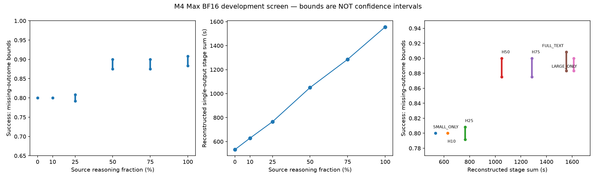

# Early text handoff: completed development screen

**Decision: a 50% handoff is a plausible quality/latency candidate, not a validated improvement or a deployable policy.** It uses half the source reasoning tokens and has 87.50–90.00% possible success versus 80.00% small-only, at 1,050.40 s reconstructed stage time versus 533.15 s. It is 34.86% faster than large-only and 32.49% faster than full-text handoff under local stage accounting. But 13 missing scores on one task, only 40 reused development tasks, and broad paired uncertainty prevent a quality-equivalence or generalization claim. Small-only remains the cheapest measured option. No new experiment is authorized by this report.

## Scope, provenance and frozen protocol

All **40 original development IDs**, in original membership order, were used; none was selected or dropped after results. The exact ordered list, source-row hashes, platform/difficulty metadata, pins and sampling contract are in [`declaration.json`](configs/early_handoff_01/declaration.json). Per-task outcomes are in [`task_outcomes.csv`](results/early_handoff_01/task_outcomes.csv). These are previously inspected development tasks, **not fresh confirmation**. The declaration’s PLANNED_PREFLIGHT_NOT_LAUNCHED status is the preserved pre-run document, not live status.

Generation implementation: `bf85c69508589c8f7027af3cdbe10b91904ed921`. All 840 answers and 1,680 sealed answer/record file hashes and sizes were verified. The audit also checks every prompt/prefix/answer contract, seed, source trajectory identity, score identity and the exact task × condition × draw inventory. Scoring started only after the full generation seal. The final safe code/report commit is recorded in the review ZIP’s `MANIFEST.json` (a report cannot embed its own commit hash).

| Dependency | Exact pin |
|---|---|
| Qwen/Qwen3-32B | `9216db5781bf21249d130ec9da846c4624c16137` |
| Qwen/Qwen3-8B | `b968826d9c46dd6066d109eabc6255188de91218` |
| LiveCodeBench official code_generation_lite, release_v6 | `0fe84c3912ea0c4d4a78037083943e8f0c4dd505` |
| tokenizer.json SHA256, shared | `aeb13307a71acd8fe81861d94ad54ab689df773318809eed3cbe794b4492dae4` |
| tokenizer_config.json SHA256 | `d5d09f07b48c3086c508b30d1c9114bd1189145b74e982a265350c923acd8101` |

Official upstream benchmark files, task identities/row hashes and all 22 model shards were verified locally. No private archive artifacts are required. LiveCodeBench text/tests, reversible token arrays and raw answers are **not redistributed**. HumanEval+ attribution and the public release remain unchanged.

Hardware: local Apple M4 Max, 128 GB, macOS 27.0; Python 3.12.4, torch 2.14.0, Transformers 4.57.6, nonquantized BF16 MPS/SDPA, batch 1, 512-token initial prefill chunks. One model was resident at a time. Both models passed synthetic bitwise replay/RNG continuation and 36,865-token prefill gates before benchmark work. This is not an H200 replication.

For each task: one source reasoning trajectory; six receiver conditions at **0/10/25/50/75/100%** plus LARGE_ONLY; three fixed final-answer draws per condition. Fractions use `floor(f × L)` of actual source reasoning tokens, excluding the closing-think token, without moving syntactically awkward cuts. Intermediate conditions receive only the original prompt plus the exact prefix and **continue reasoning**. FULL_TEXT replays the whole reasoning prefix natively and answers. No cache translation, source final answer, future reasoning, extra instruction or router is given to the receiver.

Sampling: temperature 0.6, top-p 0.95, top-k 20, min-p 0, repetition penalty 1, presence penalty 0; deterministic algorithms enabled. Source reasoning cap 24,576 tokens; receiver continuation cap 24,576 minus the source prefix; answer cap 4,096; total limit 40,960. All caps remain in results. Fixed SHA256-derived seeds use `early_handoff_01|task_id|draw_index|stream`, first eight bytes modulo 2^63. Receiver reasoning seed is shared across fractions; receiver answer seed is matched by draw across fractions. Source streams are separate. Three draws share a single reasoning history and are not three independent tasks.

## All fixed-condition results

Success is the equal-task average of three answer scores. Each condition has 120 planned draws. For conditions with missing scores, exact rates and primary quality CIs remain **null**, as specified before the run. The displayed range is **partial-identification bounds**: missing answers all fail versus all pass, with the original denominator. It is not a confidence interval. No missing answer is silently treated as a failure or removed.

| Condition | Pass / fail / missing | Success or bounds (%) | Mean reconstructed seconds | Source body tokens | Receiver reasoning tokens | Answer tokens |
|---|---:|---:|---:|---:|---:|---:|
| SMALL_ONLY | 96 / 24 / 0 | 80.00 | 533.15 | 0.00 | 8814.50 | 636.98 |
| H10 | 96 / 24 / 0 | 80.00 | 628.37 | 865.52 | 7941.12 | 612.62 |
| H25 | 95 / 23 / 2 | 79.17 to 80.83 | 765.47 | 2164.43 | 6585.20 | 600.58 |
| H50 | 105 / 12 / 3 | 87.50 to 90.00 | 1050.40 | 4329.32 | 4845.30 | 613.79 |
| H75 | 105 / 12 / 3 | 87.50 to 90.00 | 1285.56 | 6493.93 | 2264.05 | 619.17 |
| FULL_TEXT | 106 / 11 / 3 | 88.33 to 90.83 | 1555.99 | 8659.08 | 0.00 | 617.62 |
| LARGE_ONLY | 106 / 12 / 2 | 88.33 to 90.00 | 1612.44 | 8659.08 | 0.00 | 592.64 |

SMALL_ONLY and H10 each have task-cluster 95% success intervals of **67.50–92.50%**. These wide exploratory intervals matter. Numeric tables retain all unrounded values, scalar output lengths, caps, seeds and provenance hashes.



## Paired task comparisons and missingness sensitivity

Primary inference uses **10,000 paired task-cluster resamples**, frozen PCG64 seed 20260922. Every draw for a sampled task stays together; comparisons use the same resampled tasks. Intervals are exploratory and unadjusted for multiple comparisons. With complete coverage H10 minus SMALL_ONLY is **0.00 percentage points (95% CI −7.50 to +7.50)**: one improved task, one worsened task and 38 ties.

The pre-run primary quality comparisons touching missing outcomes remain null in `summary.json`. To make the incomplete screen interpretable, the following **explicitly post-run sensitivity analysis** keeps all 40 tasks and bounds every missing score. Its envelope takes the 2.5th percentile of adverse-completion paired bootstraps and the 97.5th percentile of favorable-completion paired bootstraps. This combines missingness and task sampling sensitivity; it is not an equivalence test or a conventional CI around an identified effect. No scoring or generation was changed.

| Comparison | Mean difference bounds (pp) | Bootstrap sensitivity envelope (pp) | Definite gain / loss / tie / ambiguous tasks | Latency ratio |
|---|---:|---:|---:|---:|
| H10-SMALL_ONLY | 0.00 to 0.00 | -7.50 to 7.50 | 1 / 1 / 38 / 0 | 1.179 |
| H10-LARGE_ONLY | -10.00 to -8.33 | -20.00 to -0.83 | 0 / 4 / 35 / 1 | 0.390 |
| H10-FULL_TEXT | -10.83 to -8.33 | -20.83 to -0.83 | 0 / 4 / 35 / 1 | 0.404 |
| H25-SMALL_ONLY | -0.83 to 0.83 | -8.33 to 9.17 | 1 / 2 / 36 / 1 | 1.436 |
| H25-LARGE_ONLY | -10.83 to -7.50 | -20.00 to 0.83 | 0 / 5 / 34 / 1 | 0.475 |
| H25-FULL_TEXT | -11.67 to -7.50 | -21.67 to 0.83 | 0 / 5 / 34 / 1 | 0.492 |
| H50-SMALL_ONLY | 7.50 to 10.00 | 0.00 to 20.00 | 3 / 0 / 36 / 1 | 1.970 |
| H50-LARGE_ONLY | -2.50 to 1.67 | -10.00 to 9.17 | 1 / 1 / 37 / 1 | 0.651 |
| H50-FULL_TEXT | -3.33 to 1.67 | -11.69 to 9.17 | 1 / 1 / 37 / 1 | 0.675 |
| H75-SMALL_ONLY | 7.50 to 10.00 | 0.00 to 20.00 | 3 / 0 / 36 / 1 | 2.411 |
| H75-LARGE_ONLY | -2.50 to 1.67 | -6.67 to 7.50 | 0 / 1 / 38 / 1 | 0.797 |
| H75-FULL_TEXT | -3.33 to 1.67 | -9.17 to 7.50 | 0 / 1 / 38 / 1 | 0.826 |

All paired stage-time differences and their task-cluster intervals are in [`paired_comparisons.csv`](results/early_handoff_01/paired_comparisons.csv). H50 versus LARGE_ONLY is −562.04 s (95% interval −723.18 to −414.23); versus FULL_TEXT, −505.59 s (−665.20 to −360.99). Those intervals describe these reconstructed local timings, not serving-system speedups.

## Answers to the six research questions

**A. Does early handoff materially outperform small-only?** In this sample, H50 and H75 each improve success by **7.50–10.00 pp** under any completion of missing scores. Each has three definite task gains and no definite losses versus SMALL_ONLY. But the sensitivity envelope is **0 to +20 pp**; this is a development signal, not established out-of-sample superiority. H10 is flat and H25 is within ±0.83 pp.

**B. Does it approach large-only/full-text while avoiding source work?** H50 uses 4,329.33 instead of 8,659.08 mean source body tokens and has success bounds close to both references. It reduces the local stage sum by **34.86% versus large-only** and **32.49% versus full-text**. Quality differences remain −2.50 to +1.67 pp versus large-only and −3.33 to +1.67 pp versus full-text, with much wider sampling envelopes. “Approaches in this sample” is justified; “equivalent quality” is not.

**C. Is there a potentially useful Pareto improvement?** H50 is the main candidate, but no confirmed dominance of the high-quality references is established. SMALL_ONLY empirically dominates H10 in aggregate: identical quality, with H10 taking 17.86% more time than SMALL_ONLY. H50 and H75 have the same observed pass count, with H50 faster, but their missing outcomes prevent identified quality equality. The frozen exact-score frontier lists only SMALL_ONLY because it excludes every incomplete condition; that is **not** evidence that all early conditions are dominated. The missingness-sensitive potential frontier includes SMALL_ONLY, H25, H50, H75, FULL_TEXT and LARGE_ONLY. This broad set reflects unresolved quality, not six recommendations.

**D. How much source reasoning can be removed before quality collapses?** There is no catastrophic collapse: even 0% scores 80%. Removing half the source trace retains the high-quality range in this sample; removing 75–90% returns to roughly small-only quality. The quality increase lies between the tested 25% and 50% points. There is no measured universal threshold between them, and no monotone per-task guarantee.

**E. Does the receiver compensate?** Yes. Mean receiver reasoning grows from **0 at full-text** to **2,264 tokens at 75%, 4,845 at 50%, 6,585 at 25%, 7,941 at 10%, and 8,815 at 0%**. H50 has **9,788 total generated body/answer tokens**, more than full-text’s **9,277**, despite fewer source tokens. It saves time because more work runs on the faster receiver, not because total generated work disappears. Full-text prefill is 14.76 s, under 1% of its 1,555.99 s stage sum; early source substitution remains the larger lever.

**F. Are gains/failures task-specific or predictable?** They are heterogeneous, but predictability was not tested. `leetcode/3413` gains at every nonzero fraction, `leetcode/3455` at 50% and above, `leetcode/3482` scores 3/3 at H50 but 0/3 at H75 and 1/3 at full/large, and `leetcode/3454` only gains at 75%/full/large. H10 loses `leetcode/3466`; H25 loses `atcoder/abc353_e` and one draw on `leetcode/3450`. These are retrospective descriptions, not validated features or a router. No semantic/predictive claim is inferred from hidden tests.

## Retrospective oracle — not a deployable result

The frozen full-population point oracle remains null because of missingness. A post-run supplementary quality-first, latency-tiebreak oracle over fraction conditions (not LARGE_ONLY) has an all-40-task success range of **90.00–92.50%**. On the explicitly labeled **39 fully scored tasks**, excluding only `atcoder/abc364_e` from this supplemental calculation, its same-draw success is **92.31%**, at **569.01 s** mean reconstructed time. Choices: SMALL_ONLY 27 tasks, H10 9, H50 2, H75 1. The excluded task is retained in every primary table and all-population bound. Per-task selections are in `missingness_sensitivity.json`.

This oracle uses outcome knowledge and future total source length; the same three draws select and evaluate each choice. Its apparent opportunity is optimistic and can include timing noise. It does not show that an online selector can recognize those tasks, and it is not directly comparable to a full-40-task point estimate. No policy was trained.

## Timing and economic accounting

Per-output accounting sums **source prefix time + receiver native prefill + receiver continuation + one final answer + native closing bridge + cache clone + local prefix assembly**. Required reasoning is charged in full to each hypothetical final output, not amortized across the three draws. Prefix time is taken from saved cumulative source token timestamps, not a linear fraction of whole-run time. Source prefix timestamps end at sampled emission; they are not a separately timed paused online system. Full-source time includes source prefill. No network transfer was used.

| Condition | Source prefix s | Receiver prefill s | Receiver reasoning s | Answer s | Bridge/clone/assembly s | Total generated tokens |
|---|---:|---:|---:|---:|---:|---:|
| SMALL_ONLY | 0.00 | 0.66 | 492.90 | 39.50 | 0.0854 | 9451.48 |
| H10 | 139.23 | 1.74 | 450.65 | 36.67 | 0.0837 | 9419.27 |
| H25 | 350.19 | 3.49 | 375.84 | 35.86 | 0.0815 | 9350.20 |
| H50 | 716.09 | 6.77 | 290.14 | 37.32 | 0.0786 | 9788.42 |
| H75 | 1100.20 | 10.52 | 137.28 | 37.47 | 0.0806 | 9377.14 |
| FULL_TEXT | 1504.12 | 14.76 | 0.00 | 37.03 | 0.0764 | 9276.70 |
| LARGE_ONLY | 1504.12 | 0.00 | 0.00 | 108.10 | 0.2213 | 9251.72 |

Reasoning-body counts exclude closing-think; answer counts include terminal EOS. Prompt/prefill counts and output character lengths are in `condition_summary.csv`. These stage sums are **reconstructed one-output local latency estimates** from measured components. The experiment ran all source tasks first, then all receiver tasks; it did not measure an end-to-end live handoff service. Model loading and host/Python/checkpoint overhead are separately recorded, not assumed absent in deployment.

Actual benchmark generation took **47.662 hours** (171584.495 s), with no generation restart/recovery. Unique measured reasoning, prefill, answer and setup work totals **47.632 hours**. Model loads total 36.545 s; the remaining 74.029 s is unallocated host/IO/cleanup/scheduling overhead. This does **not** sum all hypothetical per-output costs, which would repeatedly charge reused histories.

Actual emitted tokens: source reasoning 346,401, source answers 71,117, receiver reasoning 1,218,200, receiver answers 444,091. These actual emission counts include natural closing tokens. Scoring took 22.78 minutes elapsed, with 2730.84 s of summed draw time across two workers. Launch to the initial reporting failure was 48.043 hours. Downloads, synthetic preflights, tests and final review were additional work, not included in generation elapsed time.

**New RunPod charges: $0.** No remote resources were allocated. Local energy, hardware depreciation, GPU-kernel busy seconds/hours and monetary cost per successful answer were not measured. Synchronized MPS wall time is not kernel-busy time. There is no H200 dollar-saving claim and no claim of free compute.

## Failures and infrastructure incidents

**709 passed, 118 observed failures, 13 missing** across 840 answers. Observed failures: 104 test assertions, 10 CPU timeouts, 2 memory-limit failures, 1 runtime error and 1 syntax error. All are retained. Reasoning caps affected 2/40 source trajectories; receiver caps affected SMALL_ONLY 3/40 and each intermediate fraction 1/40. One SMALL_ONLY answer reached the 4,096-token cap; no other answers did. No early reasoning EOS occurred. Capped source histories still define the full fraction reference; they are not guaranteed complete solutions.

**Scoring capacity incident:** all 13 missing outcomes belong to `atcoder/abc364_e`: H25 2, H50 3, H75 3, FULL_TEXT 3, LARGE_ONLY 2. The unchanged scorer classified external SIGKILL as infrastructure missing, not a quality failure. Guest kernel logs record **27 out-of-memory kills** of Python scoring children. The local VM was underprovisioned: **6 GiB total RAM with two concurrent candidates**, while each candidate could use up to 4 GiB address space. The scorer performed its frozen 14 infrastructure retries; 13 remained missing, one retry recovered coverage. This avoidable provisioning error limits the evidence. The results have not been “fixed” by additional retries, changed memory limits or reclassification.

The unchanged scorer uses CPU 12 s, wall 46 s, 4 GiB address space and its existing output/confinement contract. It ran in an offline ARM Linux container/Colima VM with chroot, UID isolation and seccomp. ARM timing differs from the historical x86 scorer. No hidden tests were used to improve answers. Scoring was not rerun during review.

**Reporting incident:** the first plot attempted to annotate a null pass rate and failed. The report-only fix displays missingness bounds and preserves null primary estimates. Audit also corrected the exporter’s `receiver_seed` metadata, which initially repeated the answer RNG seed; it now records the actual reasoning seed (null for full-text, which generates no receiver reasoning). Saved generation seeds, outputs, scorer and numeric scores were unchanged. Compact regeneration writes `analysis_draft.md` in its output directory rather than overwriting this reviewed report.

## Limitations and conclusion

- Forty reused development task clusters are a small, exposed population; three final draws do not remove reasoning-trajectory variance. One reasoning history was sampled per task/condition.
- Missingness is concentrated on a memory-intensive task and is not assumed random. Bounds retain it; supplemental 39-task oracle results are not the primary population.
- Multiple fractions/comparisons, a post-run sensitivity analysis and same-draw oracle make this exploratory. No equivalence margin or fresh confirmation exists.
- Fixed fractions require future total source length. They are retrospective cuts, not an online stopping mechanism. A practical decision rule and its overhead have not been evaluated.
- Receiver cap shrinks with source prefix length. Caps, forced closing and model/backend/CPU architecture differences limit comparisons with historical experiments.
- Sampling kernels, MPS versions, Colima/package builds and hardware may change exact outcomes and timings. Pinned weights/data plus these commands do not promise cross-platform bitwise reproduction. The Ubuntu base digest is pinned but its apt-installed package snapshot is not.
- No serving concurrency/load test, local energy/depreciation estimate, H200 cost estimate, learned router, mapper, sparse mechanism or cache translation was evaluated.

**Bottom line:** moving half the large-model reasoning to the smaller model produces a candidate worth further *review*: similar observed quality at materially lower local reconstructed latency than finishing on the large model, but much slower than small-only. The screen does not prove economic or Pareto improvement. Stop here; any confirmation, scoring recovery or online policy work requires a separate decision.

## Exact reproduction and verification

From the public research branch, use a clean checkout and an environment with the versions above. No private checkout is needed. `PY` below names that installed environment. The complete retrieval/generation/scoring instructions are in [`REPRODUCE_EARLY_HANDOFF.md`](REPRODUCE_EARLY_HANDOFF.md). Raw benchmark reproduction is costly and is **not** part of this completed review.

```sh
git clone --branch research/early-handoff-01 https://github.com/ImpossibleComputing/Gearshift.git
cd Gearshift
# For the exact reviewed tree: git checkout <release_commit from MANIFEST.json>
export PY=/absolute/path/to/pinned-environment/bin/python
export PYTHONDONTWRITEBYTECODE=1
$PY -m pytest -q
# Safe numeric-only regeneration (no GPU, no raw benchmark access):
$PY scripts/early_handoff_report.py --input results/early_handoff_01/analysis_input.json --output data/early_handoff_01/review_regenerated
$PY scripts/early_handoff_audit.py --compact --input results/early_handoff_01/analysis_input.json --output data/early_handoff_01/review_regenerated
# audit.json is the retained measured provenance receipt, not inferable from aggregate data:
cp results/early_handoff_01/audit.json data/early_handoff_01/review_regenerated/audit.json
$PY scripts/early_handoff_finalize.py --results data/early_handoff_01/review_regenerated --report data/early_handoff_01/review_regenerated/EARLY_HANDOFF_RESULTS.md
```

For a fresh **separately authorized** raw reproduction:

```sh
$PY scripts/fetch_livecodebench.py
$PY scripts/early_handoff_dependencies.py --workers 4
$PY scripts/early_handoff_prepare.py
# Create the bounded local budget ledger exactly as documented in REPRODUCE_EARLY_HANDOFF.md.
$PY scripts/early_handoff_worker.py preflight --role receiver
$PY scripts/early_handoff_worker.py preflight --role source
colima start --cpu 4 --memory 6 --disk 20 --arch aarch64 --vm-type vz
export DOCKER_HOST="unix://$HOME/.colima/default/docker.sock"
docker build -t gearshift-early-scorer:01 - < configs/early_handoff_01/Scorer.Dockerfile
docker run --rm --network none --mount "type=bind,src=$PWD,dst=/repo,readonly" --mount "type=bind,src=$PWD/data/early_handoff_01,dst=/experiment" gearshift-early-scorer:01 python3 scripts/early_handoff_score.py preflight
caffeinate -is $PY scripts/early_handoff_pipeline.py
# Historical pipeline is expected to stop at the original plot bug on generation commit bf85c69.
# On the reviewed branch the report-only fix avoids that error; no scoring settings changed.
$PY scripts/early_handoff_report.py
$PY scripts/early_handoff_audit.py
```

The commands preserve the **historical 6 GiB/two-worker scoring setup**, including its known capacity risk; they are not a recommendation to repeat that risk. The original stopped pipeline/status/logs remain in ignored storage. A future corrected-capacity scoring run must be separately labeled rather than replacing this evidence.

Review exports: `analysis_input.json`, `per_draw.json/csv`, `per_task.csv`, `task_outcomes.csv`, `condition_summary.csv`, `paired_comparisons.csv`, `summary.json`, `missingness_sensitivity.json`, `audit.json`, `frontier.png` and `verification.json`. The review ZIP includes safe code/config, licenses, provenance and a SHA256 manifest. Original main/progress-02, private archive and website are unchanged. **No new research was launched; this round is complete.**
